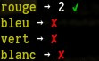

# Usage

## ٭ node

	npm i stick-js # or yarn

	cat >.babelrc <<EOT
	{"presets": ["babel-preset-es2015", "stage-0"], "plugins": [
		"babel-plugin-operator-overload"
	]}
	EOT

    // --- src/index.js

		defineBinaryOperator ('|',  (...args) => pipe         (...args))
		defineBinaryOperator ('<<', (...args) => compose      (...args))
		defineBinaryOperator ('>>', (...args) => composeRight (...args))

		import { pipe, compose, composeRight, map, join, sprintf1 } from 'stick-js'
		import { green } from 'chalk'

		; [1, 2, 3]
		| map (x => x + 1)
		| join ('/')
		| green
		| sprintf1 ('The answer is %s')
		| console.log

	// ---

	node_modules/.bin/babel -d lib src
	node lib/index.js

## ٭ webpack

### webpack config:

	module: {
	  rules: [
	    {
	      test: /\.js$/,
	      exclude: /node_modules/,
	      use: {
	        loader: 'babel-loader',
	        options: {
	          presets: [[
	            "env",
	            { "modules": false },
	          ]],
	          plugins: [
	            'operator-overload',
	          ],
	        },
	      },
	    },
		...
	  ]
	  ...
	  }

# What we provide

- A way to start using the pipe (or 'stick') operator today while 
  proposal
  [TC39/proposal-pipeline-operator](https://github.com/tc39/proposal-pipeline-operator)
  is still being fleshed out.

- Companion operators `>>` and `<<` for composing. Often a pipeline can be
  made more interesting and reusable by abstracting away the data to leave a
  'point-free' form. See below for many examples of this.

- Note that we use `|`, not `|>`, which is not only easier to overload but
  far more pleasant to work with, and which will still work even if/when the
  proposal is accepted.

- A toolkit of functions centered around this pattern, and a number of
  idioms which they facilitate; in particular, we provide several ways to
  replace blocks of statements by referentially transparent expressions,
  and work with prototypes, factories, mutable and immutable data, and more.

  You can use our functions, or your own favorite library (Ramda, lodash/fp,
  etc.), or mix and match as you like.

- Practical examples and advice which will hopefully be of use to TC39,
  after using these idioms in many projects for about a year. In particular,
  we hope to make a strong case that composition operators should be
  considered in addition to a pipeline operator.

The overloading is made possible thanks to the great
[babel-plugin-operator-overload](https://github.com/jussi-kalliokoski/babel-plugin-operator-overload)
library by Jussi Kalliokoski (@jussi-kalliokoski).

# TL; DR

A few examples:

    import chalk from 'chalk'

	; [1, 2, 3]
	| map (x => x + 1)
	| join ('/')
	| chalk.green
	| sprintf1 ('The answer is %s')
	| log // outputs 'The answer is 2/3/4' (colorfully)

----------

	const isInteger = x => x === Math.floor (x)
	const ifInteger = isInteger | ifPredicate

	; [3.5, 4, 4.2]
	| map (ifInteger (
	  x => x + 1,
	  always ('nothing'),
	))
	// ['nothing', 5, 'nothing']

----------

	const convertFahrenheit = fah => lets (
	  _ => (fah - 32) / 9 * 5,    // (1) celsius
	  (cel) => cel + 273,         // (2) kelvin
	  (cel, kel) => [cel, kel],   // (3) result
	)
	
	convertFahrenheit (86) // [30, 303]

----------

	const checkVal = condS ([
	  4 | eq    | guard  (sprintf1 ('%s was exactly 4')),
	  4 | lt    | guard  (sprintf1 ('%s was less than 4')),
	  4 | gt    | guard  (sprintf1 ('%s was more than 4')),
	  otherwise | guardV ("error, this shouldn't happen"),
	])
	
	; [3, 4, 5]
	| map (checkVal)
	| join (' | ')
	// 3 was less than 4 | 4 was exactly 4 | 5 was more than 4

----------

	// ------ dog.js
	const proto = { speak () { 'Hi from ' + this.name }}
	export default proto | factory
	
	// ------ main.js
	import Dog from './dog'
	Dog.create ({ name: 'Caesar', }).speak () // 'Hi from Caesar'

----------

And much more.

# Overview

## ٭ basic example ٭

    // --- source files must begin with this header.

	defineBinaryOperator ('|',  (...args) => pipe         (...args))
	defineBinaryOperator ('<<', (...args) => compose      (...args))
	defineBinaryOperator ('>>', (...args) => composeRight (...args))

	import {
		pipe, compose, composeRight,

	// --- /header

		map, join, sprintf1,
	} from 'stick-js'

	import { green, } from 'chalk'

	const { log, } = console

	; [1, 2, 3]
	| map (x => x + 1)
	| join ('/')
	| green
	| sprintf1 ('The answer is %s')
	| log // outputs 'The answer is 2/3/4' (colorfully)

## ٭ the 'stick' operator ٭

`a | b` is simply an equivalent way of writing `b (a)`

A really simple idea, with some pretty far-reaching consequences.

(What if I really want to do bitwise math, you ask? Don't worry, you still
can: see below).

    // --- reminder: source files must begin with this.
	// --- from here on out we'll omit it in the examples.
	defineBinaryOperator ('|',  (...args) => pipe         (...args))
	defineBinaryOperator ('<<', (...args) => compose      (...args))
	defineBinaryOperator ('>>', (...args) => composeRight (...args))

	import {
	  pipe, compose, composeRight,
	  map, join, split,
	} from 'stick-js'

	const multiply = x => y => x * y
	const double = multiply (2)     // or 2 | multiply

	3 | double                      // 6
	double (3)                      // 6
	3 | multiply (4)                // 12

    const capitaliseFirstLetter = x => x[0].toUpperCase () + x.slice (1)

	'just a perfect day'
	  | split (' ')                 // split (' ') is a function
	  | map (capitaliseFirstLetter) // map (capitaliseFirstLetter) is also a function
	  | join (' ')                  // ... you get the picture.
    // 'Just A Perfect Day'

## ٭ currying styles ٭

All curried functions provided by stick-js can be called using either of 2 currying styles.

This would be a good time to read up on curried functions if you're not familiar with them.

1. we will refer to this sort of function and calling style as 'manual':

		const f = a => b => c => a + b + c          // call like f (1) (2) (3)

2. and this sort as 'normal':

		const g = R.curry ((a, b, c) => a + b + c) // call like g (1) (2) (3)
		                                           // or g (1, 2, 3)
	                                               // or g (1, 2) (3)
                                                   // or g (1) (2, 3)
                                                   // etc.

Calling:

	import { map, } from 'stick-js'
	const double = x => x * 2

	map (double, [1, 2, 3])    // [2, 4, 6] (normal style)
	map (double) ([1, 2, 3])   // [2, 4, 6] (manual style)
	; [1, 2, 3] | map (double) // [2, 4, 6] (manual style with stick)

For extra performance you can also limit yourself to the manual style (see
below).

## ٭ a note on style ٭

We recommend using a space before the parentheses of a function call.
Admittedly it looks pretty strange at first, but we find that it makes
everything much clearer when you get used to it, in particular with the
manual currying style.

You might also want to check out a vertical alignment plugin. The author
uses `vim-easy-align` by @junegunn.

## ٭ markers ٭

	import { sprintfN, sprintf1, } from 'stick-js'

	3 | sprintf1 ('4 - 1 is %s') // '4 - 1 is 3'

'N' is a marker meaning an array is expected.

	; [4, 3]
	| sprintfN ('%s - 1 is %s')  // same.

'V' means a value is expected, to disambiguate cases where a function also
fits.

	import { timesV, timesF, } from 'stick-js'

	const { random, } = Math

	3      | timesV (4)          // [3, 3, 3, 3]
	random | timesF (4)          // [<random-num>, <random-num>, <random-num>, <random-num>]
	random | timesV (4)          // [random, random, random, random]

Note that the last one stores the function 4 times in the array.

    random | timesV (4) | map (invoke) // [<random-num>, <random-num>, <random-num>, <random-num>]

'M' means the data is being mutated. In JS we of course work with mutable data all the time, and this will never change.

    import { appendTo, appendToM, } from 'stick-js'

	const a = [1, 2, 3]
	const b = 4 | appendTo (a) // functional style: the array is cloned.
	b === a // false

	const a = [1, 2, 3]
	const b = 4 | appendToM (a) // non-functional style: the array is mutated.
	b === a // true

	const webGLContext = { ... a complicated object ... }
	webGLContext | mergeM ({ someProp: false, }) // you probably want mutable here.

And there are a few more which we'll see along the way.

## ٭ ok, anaphoric if ٭

`ok (x)` is false if `x` is `null` or `undefined`. Every other input returns
`true`.

	import { map, ok, notOk, ifOk, } from 'stick-js'

	const { log, } = console

	; [0, false, '', null, void 8]
	| map (ok)    // [true, true, true, false, false]

	; [0, false, '', null, void 8]
	| map (notOk) // [false, false, false, true, true]

Something we see a lot in JS is:

	let answer
	if (someVar !== undefined && someVar !== null) {
	  answer = someVar + 1
	} else {
	  answer = 'nothing'
	}

This can vastly improved using an 'anaphoric if' and a stick idiom:

	import { add, always, } from 'stick-js'

	const add1 = 1 | add                                     // or add (1)
	const answer = someVar | ifOk (add1, 'nothing' | always)

Explanation: `ifOk` takes two functions -- a 'then' function and an 'else' function.
In the 'ok'	case, the value being tested is passed to the function. (This
bound value is sometimes called an 'anaphor').

	const add1IfYouCan = val => val | ifOk (
	  // `that` refers to `val`
	  that => that + 1,

	  // no value is passed.
	  _ => 'nothing',
	)

This can be further condensed, using 'point-free style' (see below) and the `always` function:

	const add1IfYouCan = ifOk (1 | add, 'nothing' | always)

Usage:

	const answer = someVar | add1IfYouCan

	; [0, 10, null, void 8]
	| map (add1IfYouCan) // [1, 11, 'nothing', 'nothing']

## ٭ point-free ٭

A common pattern is when the argument to a function is passed immediately into a pipe:

	const add1IfYouCan = x => x | ifOk (add1, 'nothing' | always)

Since `x` does not appear anywhere else in the expression, we can simply remove it, along with the function argument:

	const add1IfYouCan = ifOk (add1, 'nothing' | always)

This is often called 'point-free' style. It means the function arguments and
the data being passed through the pipeline have been abstracted away (and
has nothing to do with dots, despite the name).

If the pipe chain consists of more than 1 link …

	const { dot, sprintf1, tap, }
    const { log, } = console

    const add1IfYouCan = x => x
	  | ifOk (add1, 'nothing' | always)
	  | String                        // conversion using type constructor
	  | dot ('toUpperCase')
	  | sprintf1 ('The answer is %s')
	  | tap (log)                     // outputs 'The answer is 1', 'The answer is NOTHING', ...

… then we remove the `x => x` and change all the `|` to `>>`

    const add1IfYouCan =
	  ifOk (add1, 'nothing' | always)  // (1)
	  >> String                        // (2)
	  >> dot ('toUpperCase')           // (3)
	  >> sprintf1 ('The answer is %s') // (4)
	  >> tap (log)                     // (5)

The following pattern always holds:

    a | b | c = a | (b >> c)

So when the chains start to get long (as above), you can cut pieces out
using this property. For example, you can refactor lines 2-4 into a new
function:

    // --- convert input to String, make uppercase, perform sprintf.
    const processString = String
	  >> dot ('toUpperCase')
	  >> sprintf1 ('The answer is %s')

And splice it back in:

	const add1IfYouCan = x => x
	  | ifOk (add1, 'nothing' | always)
	  | processString
	  | tap (log)
	  
Or

	const add1IfYouCan =
	  ifOk (add1, 'nothing' | always)
	  >> processString
	  >> tap (log)

## ٭ compositional predicates ٭

`ifOk` is a convenience for `ifPredicate (ok)` or `ok | ifPredicate`.

There is also a 'when' form, which has no 'else' branch.
	  
	import { add, whenOk, } from 'stick-js'

	const add1 = 1 | add // or add (1)

	3    | whenOk (add1) // 4
	null | whenOk (add1) // undefined

The selection of `if` and `when` functions we provide is intentionally skimpy, to encourage you to compose your own.

	const { floor, } = Math

	// --- predicate to match integers.
	const isInteger = x => x === floor (x)

	// --- or how about
	// import { eq, } from 'stick-js'
	// const isInteger = x => x | floor | eq (x)

	// --- or if you're getting bored:
	// import { timesV, asteriskN, passToN, } from 'stick-js'
	// const arrowSnd = f => timesV (2) >> asteriskN ([id, f])
	// const isInteger = arrowSnd (floor) >> passToN (eq)

	// --- now compose it into an anaphoric if:

	const ifInteger = isInteger | ifPredicate

    // --- now use it:

	const add1 = add (1)

	; [3.5, 4, 4.2]
	| map (ifInteger (add1, 'nothing' | always))
	  // ['nothing', 5, 'nothing']

More complicated predicates:

	const both = (f, g) => againstAll ([f, g])

	const isOdd = x => x % 2

	const isOddInteger = both (isInteger, isOdd)
	const ifOddInteger = isOddInteger | ifPredicate

	; [3.5, 4, 5, 5.5]
	| map (ifOddInteger (
	  add1,
	  'nothing' | always,
	))
	// ['nothing', 'nothing', 6, 'nothing']

	; [3.5, 4, 5, 5.5] | map (isOddInteger)
	// [false, false, 1, false]

Note that `againstAll` returns the return value of the last matching
function, hence `1` in the last example. This is because it can be useful to
have that value, and it's analogous to how the short-circuit `&&` works.

To convert a truthy expression to a strict one: simply compose it with the
type constructor `Boolean`.

    const both = (f, g) => againstAll ([f, g]) >> Boolean

Or, you could add `=== true` to the end of the `isOdd` function.

Note that `ifPredicate` and `whenPredicate` match on truthiness, not strict
truth. Rationale: that is how the native `filter` works, and JS's `if`
operator, and many other tools in e.g. Ramda. And converting truthy to
strict Boolean is trivial.

## ٭ compositional decoration ٭

Our `map` function is capped at one argument, meaning the map routine only
gets the value and not the index or the collection.

	import { map, addIndex, addCollection, } from 'stick-js'

	; [4, 5, 6]
	| map ((x, idx) => idx) // [undefined, undefined, undefined]

But:

	const mapWithIndex      = map | addIndex
	const mapWithCollection = map | addCollection

	; [4, 5, 6]
	| mapWithIndex ((x, idx) => idx) // [0, 1, 2]

	; [4, 5, 6]
	| mapWithCollection ((x, coll) => coll) // [[4, 5, 6], [4, 5, 6], [4, 5, 6]]

	; [4, 5, 6]
	| (map | addIndex | addCollection) ((x, idx, coll) => ...)

	; [4, 5, 6]
	| (map | addCollection | addIndex) ((x, coll, idx) => ...)

We can also enhance our merge functions, to deal with conflicts:

    import { mergeWith, mergeToSym, } from 'stick-js'

    const chooseTgt = (src, tgt) => tgt
    const chooseSrc = (src, tgt) => src

    // --- choose target value on conflict
	const mergeChooseTgt = mergeToSym | mergeWith (chooseTgt)

    // --- choose source value on conflict
	const mergeChooseSrc = mergeToSym | mergeWith (chooseSrc)

	const os = { name: 'source name', }
    const ot = { name: 'target name', }

	os | mergeChooseSrc (ot) // 'source name'
	os | mergeChooseTgt (ot) // 'target name'

Or to only merge if certain conditions hold:

	import { mergeWhen, eq, } from 'stick-js'

	const { floor, } = Math
	const isInteger = x => x | floor | eq (x)
	const srcIsInteger = (src, tgt) => src | isInteger
	const mergeToWhenSrcIsInteger = mergeToSym | mergeWhen (srcIsInteger)

	const os = { val: 2.2, vil: 3,  vol: 3.5, }
	const ot = { val: 25,  vil: 25, vol: 25,  vel: 42, }

	os | mergeTo (ot)                 // { val: 2.2, vil: 3, vol: 3.5, vel: 42, }
	os | mergeToWhenSrcIsInteger (ot) // { val: 25,  vil: 3, vol: 25,  vel: 42, }

## ٭ semantics and argument order are based where possible on English grammar ٭

(We're dying to see a port to Hungarian, too)

Once you master this, the usage becomes intuitive and greatly reduces the
need to look things up.

(Motivation: what's the argument order of `append`, `times`, and `subtract` in your favorite library?)

	import {
	  sprintfN, sprintf1, mergeTo, merge, prependTo, prepend,
	  appendTo, append, bindPropTo, bindProp, bindTo, bind, invoke,
	} from 'stick-js'

	const tgt = { thing: 'sandwich', want: 'no thanks',  }
	const src = {                    want: 'yes please', }

When a function ends in a preposition, for example, ‘To’, the identifier to
the right is the object of the preposition.

Read this as ‘merge src **to tgt**’

	src | mergeTo (tgt)                  // { thing: 'sandwich', want: 'yes please', }

The same function without the preposition means that the identifier to the right is the object of the verb ‘merge’.

Read this as: ‘**merge src** to tgt’

	tgt | merge (src)                    // { thing: 'sandwich', want: 'yes please', }

	4 | appendTo ([1, 2, 3])             // [1, 2, 3, 4]
	; ([1, 2, 3]) | append (4)           // [1, 2, 3, 4]

	0 | prependTo ([1, 2, 3])            // [0, 1, 2, 3]
	; ([1, 2, 3]) | prepend (0)          // [0, 1, 2, 3]

	const dog = {
	  name: 'Caesar',
	  speak () { return 'My name is ' + this.name },
	}

	const cat = {
	  name: 'Fritz',
	  speak () { throw new Error },
	}

	const f = 'speak' | bindPropTo (dog)
	f ()                                  // 'My name is Caesar'

    // --- 'bind prop "speak" to object'
	'speak' | bindPropTo (dog)   | invoke // same

    // --- also 'bind prop "speak" to object'
	dog     | bindProp ('speak') | invoke // same

	dog.speak | bindTo (dog) | invoke     // same

    // cat.speak ()                       // Error
	dog.speak | bindTo (cat) | invoke     // 'My name is Fritz'
	cat | bind (dog.speak)   | invoke     // 'My name is Fritz'

    // --- 'call this function on this context', i.e., bind and call.
	; ({}.toString) | callOn (3)          // '[object Number]'

	// --- 'provide this context to this function'
	; 3 | provideTo ({}.toString)         // '[object Number]'

Note that this fits the `a | b | c` pattern:

	dog.speak | bindTo (cat) | invoke     // 'My name is Fritz'

So we can also write it as `a | (b >> c)`:

	dog.speak | (bindTo (cat) >> invoke)  // 'My name is Fritz'

In fact `bindTo (x) >> invoke` is already provided under the name `callOn`,
and its inverse `provideTo`:

    dog.speak | callOn (cat)              // 'My name is Fritz'
    cat       | provideTo (dog.speak)     // 'My name is Fritz'

Some other miscellaneous examples.

	// --- '3 to the 4th'
	3 | toThe (4)                         // 81

	// --- 'divide 3 by 6' or '3 divided by 6'
	3 | divideBy (6)                      // 0.5

	// --- 'divide 3 into 6'
	3 | divideInto (6)                    // 2

	// --- 'subtract 3 from 4'
	3 | subtractFrom (4)                  // 1

	// --- 'subtract 4 from 3'
	3 | subtract (4)                      // -1

	// --- '3 minus 4'
	3 | minus (4)                         // -1

## ٭ side effects & chaining ٭ mutable vs immutable ٭

	import {
	  map, side1, appendM, append, prependM, prepend,
	} from 'stick-js'

Chaining with the `.` will often not do what you want.

	; [2, 3, 4]
	  .push (5)
	  .unshift (1) // error, return value of previous line was 5

But this will:

	const push    = 'push'    | side1
	const unshift = 'unshift' | side1

The 1 in side1 refers to the arity of the function, i.e., the exact number
of arguments it expects. When working with functions in this way it's
important to specify this.

`.push` and `.unshift`, both methods of `Array.prototype`, expect exactly
one argument, hence `side1` in both cases.

	; [2, 3, 4]
	| push (5)
	| unshift (1) // [1, 2, 3, 4, 5]

	// --- using stick functions for mutable data:

	; [2, 3, 4]
	| appendM (5)
	| prependM (1)

	// --- using stick functions for immutable data:

	; [2, 3, 4]
	| append (5)  // new array [2, 3, 4, 5]
	| prepend (1) // new array [1, 2, 3, 4, 5]

You can insert `tap` anywhere in the chain, which is guaranteed not to mess
with the pipeline no matter what it returns:

    const double = x => x * 2

    ; [1, 2]
	| map (double)               // [2, 4]
	| tap (x => console.log (x)) // still [2, 4], performs side-effect (printing)
	| tap (x => [100, 200])      // still [2, 4], for demonstration only
	| join (',')
	// '2,4'

Without the first `tap`, this would have been an error, because
`console.log` returns `undefined`.

`tap` is useful to signal the intention of performing side effects or IO. It
is also really useful for debugging. And our `side` family of functions use
`tap` under the hood.

## ٭ factory ٭ synopsis ٭

    import {
	  factory, factoryProps,
	  factoryStatics,
	} from 'stick-js'

    // --- dog.js:
    const proto = {
	  init () {
		...
		return this
	  },
	  breathe () { return 'huff' },
	  whoami ()  { return this.name },
	  getType () { return this.type },
	}

	const props = {
	  type: 'dog',
	  name: undefined,
	}

    // --- basic:
	export default proto | factory

	// --- variants:
	export default proto | factory | factoryProps (props)
	export default proto | factory | factoryStatics ({ ... }) | factoryProps (props)

    // ------ main.js

	import Dog from './dog'

	const dog = Dog.create ()
	// const dog = Dog.create ().init () // useful in practice
	dog.breathe ()                       // 'huff'
	dog.type                             // 'dog', if `factoryProps` used
	dog.getType ()                       // 'dog', same
	dog.whoami ()                        // undefined, because no default.

	const dog2 = Dog.create ({ name: 'garfunkel', })
	dog2.whoami ()                       // 'garfunkel', thanks to args to create

## ٭ factory ٭ with mixins ٭ synopsis ٭

    // ------ animal.js:

    import {
	  factory, factoryStatics, mixinM, mixinPreM,
	  factoryProps,
	  ifPredicate,
	} from 'stick-js'

    const isOdd = x => x % 2 !== 0
    const ifOdd = isOdd | ifPredicate

    // --- a 'base' object (animal)

    const proto = {
	  init () {
	    ...
	    return this
	  },
	  move () {
	    return this.numLegs | ifOdd (
	      _ => 'hobble',
	      _ => 'gait',
	    )
	  },
	  breathe () { return 'huff' },
	  speak ()   { 'not implemented' | die },
	  getType () { return this.type },
	}

	const props = {
	  type: 'animal',
	  numLegs: undefined,
	}
	
	export default proto | factory | factoryProps (props)

    // ------ cheater.js:

    // --- some orthogonal functionality

	const proto = {
      cheat: howMuch => 'I cheat ' + howMuch,
	}

	export default proto | factory

    // ------ dog.js:

    import {
	  sprintf1,
	  factory,
	} from 'stick-js'

    import Animal from './animal'
    import Cheater from './cheater'

	const { proto: animalProto, } = Animal
	const { proto: cheaterProto, } = Cheater

    // --- a composite object (dog), extended from animal, with extra functions mixed in.

    const proto = {
	  init () {
		...
		return this
	  },
	  speak () { return this.name | sprintf1 ('Dog %s says woof') }
	}

	const props = {
	  type: 'dog',
	  numLegs: 4,
	  name: undefined,
	}

	export default proto
	  | mixinPreM (animalProto)
	  | mixinM (cheaterProto)
	  | factory
	  | factoryProps (props)

    // ------ main.js

	import Dog from './dog'

	const dog = Dog.create ({ name: 'garfunkel', })
	// const dog = Dog.create ({ name: 'garfunkel', }).init () // with init
	dog.breathe ()                                  // 'huff' (from animal)
	dog.getType ()                                  // 'dog' (function from animal, property from dog)
	dog.speak ()                                    // 'Dog garfunkel says woof' (function from dog, property from instance initialisation)
	dog.cheat ('a bit')                             // 'I cheat a bit' (from cheater)

Stick idioms:

    const breathe = dot ('breathe')
	const getType = dot ('getType')
	const speak   = dot ('speak')
	const cheat   = dot1 ('cheat')
	const init    = side ('init')
	const create  = dot1 ('create')

	const dog = Dog
	  | create ({ name: 'garfunkel', })
	  | init

    dog | breathe
	dog | getType
	dog | speak

	Dog | create ({ name: 'garfunkel', })
	    | init
        | cheat

## ٭ factory ٭ explained

We provide a functional style for working with objects the way JS was
designed to: using prototypical inheritance and Object.create. We hope to
show you that the `new` keyword and 'classes' and all the baggage they bring
are unnecessary, and that they obfuscate the way that it actually works.

We provide a simple abstraction for factories, with as little sugar
and magic as possible, and encourage you to mix and match the components to
do exactly what you need.

To recap: you create an object in JS by first building a prototype object,
consisting of only functions.

    const animalProto = {
	  breathe () { return 'huff' },
	  speak () { throw new Error },
	  ...
	}

To make an `animal` instance, you pass this prototype object to `Object.create`,
assign some methods and/or properties. If you wish you can use
`Object.create` again (and again) before assigning properties, copy in some
more values, use `Object.create` again, and so on.

(Nothing will stop you from using `Object.create` on an object with
non-method properties in it, and it will probably do what you want, but it's
best avoided -- add your properties to the last object in the chain).

We encapsulate this process with the notion of a factory, which is an object
which knows how to spawn objects of a certain sort.

    import { factory, } from 'stick-js'

    const animalProto = {
	  breathe () { return 'huff' },
	  speak () { throw new Error },
	  ...
	}

	const Animal = animalProto | factory // other idioms might call it `animal` or `animalFactory`
	const animal1 = Animal.create ()
	const animal2 = Animal.create ()
	animal1.breathe () // 'huff'
	animal2.breathe () // 'huff'
	animal2.speak () // Error

To add properties:

    const animalProps = {
	  type: 'animal',
	  size: undefined,
	  numLegs: undefined,
	}

And we recommend always having an `init` method, which you will almost certainly
need. `myFactory.create ().init ()` becomes a well-worn pattern.

    const isOdd = x => x % 2 !== 0
	const ifOdd = isOdd | ifPredicate

    const animalProto = {
	  init () {
		...
		return this
	  },
	  breathe () { return 'huff' },
	  speak () { throw new Error },
	  move () {
		return this.numLegs | ifOdd (
		  _ => 'hobble',
		  _ => 'gait',
		)
	  },
	}

	const Animal = animalProto | factory | factoryProps (animalProps)

On `create`, the properties which are 'ok' will get copied in to the new
object.

The others are there for documentation: put them here, not peppered
throughout the methods. Do use `undefined` for props that are waiting to be
defined, which is arguably better than `null` and definitely better than
`false`. Use `void 8` or your very own favorite number to impress … no one.

    const animal = Animal.create ().init ()
	animal.type // 'animal'
	animal.size // undefined

You can pass an object to `create` to initialise properties. These will be
copied in *after* the props that were passed to `factoryProps` are.

    const bigBiped = Animal.create ({ size: 'big', numLegs: 2, }).init ()

You can also eliminate the dots entirely:

    const create = dot1 ('create')
	const init   = side ('init')
	const move   = dot  ('move')
	const speak  = dot  ('speak')

    Animal | create ({ size: 'small', numLegs: 2, })
	       | init
	       | move // 'gait'

Note that by using `side` for `init` we are assured that the instance is
passed down through the pipe and not the return value of `init` (although in
this case, `init` returns `this`, so `dot` would have worked too.) `create`
and `move` definitely need `dot` and not `side`.

To extend `Animal` to the obligatory `Dog` find the `Animal` prototype
(if `animalProto` is not in scope).

    const animalProto = Animal.proto

Or

    const animalProto = Animal.create ().__proto__ // might not be available in all runtimes

Create it, add dog methods, and make a new factory:

    const dogProto = animalProto
	  | Object.create
	  | mergeM ({
	    speak () { return this.loud ? 'WOOF' : 'woof' },
	  })

    const dogProps = {
	  numLegs: 4,
	  loud: undefined,
	}

	const Dog = dogProto | factory | factoryProps (dogProps)

    ; [true, false]
	| map ((isLoud) => Dog
	  | create ({ loud: isLoud, })
	  | (dog => [dog.speak (), dog.breathe (), dog.move ()])
	)
	// [['WOOF', 'huff', 'gait'], ['woof', 'huff', 'gait']]
	
Note that we can call methods of both `Animal` and `Dog` now.

## ٭ factory ٭ with mixins ٭ explained ٭

    const Dog = dogProto | mixinM (animalProto) | factory | factoryProps (dogProps)

Working with mixins is tricky. At some point, there will be namespace
conflicts and it's not always obvious which version should win out -- and
you have to decide how you want to deal with that.

But you have all the tools now to specify exactly how you want it to work.
This is where JS shines: freedom.

    const Dog = dogProto | mixinPreM (animalProto) | factory | factoryProps (dogProps)
	const dog1 = Dog | create ({})
	dog1 | breathe // 'huff'
    const Dog = dogProto | mixinPreM (animalProto) | factory | factoryProps (dogProps)
	Dog.create ({}) | speak // 'woof'

We mixed the animal into the dog as a 'pre' mixin, meaning that on name
conflicts, Dog's version will win. If we had used `mixinM` instead of
`mixinPreM`:

    const Dog = dogProto | mixinM (animalProto) | factory | factoryProps (dogProps)
	Dog | create ({})
	    | speak // Error, this is Animal's version.

Non-pre mixins are useful for orthogonal functionality -- something like
logging, for example.

You can add as many pre and post mixins as you like.

    dogProto | mixinPreM (...) | ... | mixinM (...) | ... | factory

Or use the 'N' versions to provide an array:

    dogProto | mixinPreNM ([a, b, c]) | mixinNM ([d, e, f]) | factory

Note the 'M' marker on the mixin functions. This is to make clear that these
functions mutate the prototype object, which might be a bit surprising when
using this style. We do not provide non-M versions of the mixin functions,
because it's not obvious exactly what the semantics should be, as several
alternatives could be equally intuitive.

Should the prototype chain be flattened? Should it be discarded, leaving
only the own keys? Should it create a new object using and mutate it?

You can specify these behaviors explicitly:

    dogProto | flattenPrototype | <mixin functions ...> |
    dogProto | discardPrototype | <mixin functions ...> |
    dogProto | Object.create    | <mixin functions ...> |

## ٭ let expressions ٭

You can consolidate a number of assignment statements into a single let
expression, and also limit the scope of the assignments in a way which is
easy to read. Code which is based on expressions rather than blocks of
statements can be made referentially transparent, and therefore much easier
to read, refactor, & prove the correctness of, especially considering that
each statement is a possible side-effect inducing timebomb.

    // --- convert a celsius value to both fahrenheit & kelvin.

    const convertCelsius = (c) => letV (
	  c / 5 * 9 + 32,           // fahrenheit
	  c - 273,                  // kelvin
	  (fah, kel) => [fah, kel],
	)

`letV` takes an arbitrary number of values, and expects the last one to be a
function. It simply passes the values in order to the function.

There is an 'N' form (`letVN`, which takes an array of values and one
function).

Far more useful is `lets` and `letS`. (Think `let\*` in racket).

If we went the other way, from Fahrenheit to Celsius & Kelvin:

    // --- convert fahrenheit to celsius & kelvin

	const convertFahrenheit = (f) => letV (
	  (f - 32) / 9 * 5,      // celsius
	  (f - 32) / 9 * 5 + 273 // kelvin
	  (cel, kel) => [cel, kel],
	)

We see that we are wasting work, but there is no way to capture that
intermediate expression to avoid calculating it again. With `lets`, however,
we can:

    // --- convert fahrenheit to celsius & kelvin

	const convertFahrenheit = fah => lets (
	  _ => (fah - 32) / 9 * 5,    // (1) celsius
	  (cel) => cel + 273,         // (2) kelvin
	  (cel, kel) => [cel, kel],   // (3) result
	)

`lets` expects each line to be a function. The first line is called with no
argument. The result (1) is passed as the argument to (2). The result of (1)
and the result of (2) are passed as the arguments to (3), and so on. The
result of the expression is the result of the last function.

(For now, there can be up to 6 lines. See below for a generic version).

And of course there is a stick version of `lets` called `letS`. Think of the
'S' marker as 'stick enabled' and the 's' as 'stick disabled'. `letS`
expects a value to be piped in. *Note*: the 'S' marker implies the 'N'
marker: the arguments must be an array, or else it would be impossible to
curry.

    const convertFahrenheit = fah => fah | letS ([
	  (fah) => (fah - 32) / 9 * 5,     // (1) celsius
	  (fah, cel) => cel + 273,         // (2) kelvin
	  (fah, cel, kel) => [cel, kel]    // (3) result
	])

This wouldn't be the most natural use of `letS`, but it shows how it works:
Function (1) receives as a single argument the piped in value (`fah` in this case).
Function (2) receives `fah`, and the result of (1). (3) receives `fah`, the
results of (1) and (2), and so on. 

By now we know that we can remove `fah => fah |` from the first line to
make it point-free, and we can use underscores to indicate ignored values:

    const convertFahrenheit = letS ([
	  (fah) => (fah - 32) / 9 * 5,
	  (_, cel) => cel + 273,
	  (_, cel, kel) => [cel, kel],
	])

As an exercise you could try to make the entire expression as point-free as
possible, at the expense of everyone's sanity:

    import { letS, minus, divideBy, multiply, add, arg1, list, tail, } from 'stick-js'

    const convertFahrenheit = letS ([
	  minus (32) >> divideBy (9) >> multiply (5),
	  arg1 >> add (273),
	  list >> tail,
	])

	convertFahrenheit (86) // [30, 303]

## ٭ exceptions ٭ try/catch ٭

    import { tryCatch, } from 'stick-js'

	const dubiousFunction = ...

	dubiousFunction | tryCatch (
	  // --- no exception: `v` is the return value of `dubiousFunction`
	  (v) => ...,

	  // --- exception thrown: `e` is the exception
	  (e) => e | decorateException ('Dubious function said:')
	)

Sometimes it's nice to rethrow an exception, with a string prefixed to it so
you can tell what went wrong:

	  (e) => e | decorateException ('Dubious function said:') | die

	const throwError = reason => reason
	  | exception // new Error (reason)
	  | raise     // throw it

    const throwError = reason => reason | (exception >> raise)

	// `exception >> raise` is also known as `die`

Note that this is illegal in JS, because `throw` is not an expression:

    const throwError = reason => throw new Error (reason)

But we can trick it like this:

    const throwError = reason => reason | die

	// or just
	// const throwError = die

Now we can improve this common code:

    let answer
	try {
	    answer = dubiousFunction () + 10
	} catch (e) {
	    console.warn (e)
	    answer = 'bad news'
	}

Like this:

    const answer = dubiousFunction | tryCatch (
	  plus (10),
	  (e) => {
	      e | decorateException ("That didn't go well")
	        | console.warn
	      return 'bad news'
	  },
	}

Or perhaps:

    const answer = dubiousFunction | tryCatch (
	  plus (10),
	  decorateException ("That didn't go well")
		>> tap (console.warn)
		>> ('bad news' | always)
	)

## ٭ cond ٭

    import {
	  cond, condN, condS, guard, guardV, sprintf1, otherwise,
	} from 'stick-js'

Naive form:

	cond (
	  [3 === 4, _ => 'strange'],
	  [3 === 5, _ => 'even stranger'],
	  [null, _ => 'ok'],
	)

An arbitrary number of lines can be provided.

With a stick idiom:

    cond (
	  (_ => 3 === 4) | guard (_ => 'strange'),
	  (_ => 3 === 5) | guard (_ => 'even stranger'),
	  otherwise      | guard (_ => 'ok'),
	)

If the guard functions return simple expressions, `guardV` can be more
convenient:

    cond (
	  (_ => 3 === 4) | guardV ('strange'),
	  (_ => 3 === 5) | guardV ('even stranger'),
	  otherwise      | guardV ('ok'),
	)

The most useful version is `condS`. Remember, 'S' implies 'N', so give it an
array.

    const checkVal = val => val | condS ([
	  eq (4)    | guard (val => val | sprintf1 ('%s was 4')),
	  lt (4)    | guard (val => val | sprintf1 ('%s was less than 4')),
	  gt (4)    | guard (val => val | sprintf1 ('%s was more than 4')),
	  otherwise | guardV ("error, this shouldn't happen"),
	])

Cleaning it up a bit, and inverting the parenthetical test expression to use
sticks:

    const checkVal = condS ([
	  4 | eq    | guard  (sprintf1 ('%s was 4')),
	  4 | lt    | guard  (sprintf1 ('%s was less than 4')),
	  4 | gt    | guard  (sprintf1 ('%s was more than 4')),
	  otherwise | guardV ("error, this shouldn't happen"),
	])

Wut?! This does work, strange as it looks. Try it for yourself:

	; [3, 4, 5]
	| map (checkVal)
	| join (' | ')
	// 3 was less than 4 | 4 was 4 | 5 was more than 4

## ٭ extended regexes ٭

We provide regex functions which fit the idiom and mostly have an 'X' in the
name (think /x if you know Perl).

These are 'extended regexes', in which whitespace is ignored. Note that we
do not skip comments in the regex, only whitespace, even inside character
classes. Use `\s` if you really want to match on whitespace.

	'egbert' | xMatch (/ (eg) (..) [rs] /)
	// [ 'egber', 'eg', 'be', index: 0, input: 'egbert' ]

	const vowels = []
	const mapper = appendToM (vowels)
	'egbert druppelvanger' | xMatchGlobal (/ [ae] /) (mapper)
	vowels // [ 'e', 'e', 'e', 'a', 'e' ]

    // --- same, using a regex string instead of a RegExp literal.
	'egbert' | xMatchStr (' (eg) (..) [rs] ')
	// [ 'egber', 'eg', 'be', index: 0, input: 'egbert' ]

	'egbert\ndruppelvanger' | xMatchStrFlags (' ^ d ') ('s')
	// null

	'egbert\ndruppelvanger' | xMatchStrFlags (' ^ d ') ('m')
	// [ 'd', index: 7, input: 'egbert\ndruppelvanger' ]

	const toUpper = dot ('toUpperCase')

	const ifReplaceVowels = ifXReplace (/ ([aeiou]) /) ('x')
	'egbert' | ifReplaceVowels (toUpper) ('bad' | always)
	// XGBXRT

	const ifReplaceVowelsGlobal = ifXReplace (/ ([aeiou]) /g) ('x')
	'egbert' | ifReplaceVowelsGlobal (toUpper) ('bad' | always)
	// XGBXRT

    // --- same, using a regex string instead of a RegExp literal.
	const ifReplaceVowelsGlobalAlt = ifXReplaceStrFlags (' ([aeiou]) ') ('g') ('x')
	'egbert' | ifReplaceVowelsGlobalAlt (toUpper) ('bad' | always)
	// XGBXRT

## ٭ all ٭ any ٭

If you're like the author you have a hard time remembering how Ramda's
`all`, `any`, `both`, `either`, `and`, `or`, `anyPass`, and so on work. Does
the 'all' refer to all the functions? or all the values? and so on.

Our solution to making the semantics clearer and enriching the functionality
of these functions centers around the preposition 'against': you match
a value *against* a predicate.

	const isOdd = x => isInteger (x) && (x % 2 !== 0)
	const isLt3 = 3 | lt

	// --- return `true` if input is truthy, `false` otherwise.
	const truthy = id
	// const truthy = Boolean // also works

Match *all* values *against* the predicate `isOdd`

	; [1, 2, 3, 4, 5] | allAgainst (isOdd) // false
	; [1, 3, 5] | allAgainst (isOdd) // true

Match *all* values *against* the predicate `truthy`

	const allTruthy = allAgainst (truthy)
	; [1, 2, 3, 4, 5, null] | allTruthy // false
	; [1, 2, 3, 4, 5] | allTruthy  // 5

The value matches *all* the predicates

	const isOddAndLt3 = againstAll ([isOdd, isLt3])
	1   | isOddAndLt3 // true
	1.1 | isOddAndLt3 // false
	2   | isOddAndLt3 // false
	3   | isOddAndLt3 // false

The value matches *any* of the predicates

	const isOddOrLt3 = againstAny ([isOdd, isLt3])
	2   | isOddOrLt3 // true
	3   | isOddOrLt3 // true
	4   | isOddOrLt3 // false
	5   | isOddOrLt3 // true

We can also match multiple values against multiple predicates, in various
combinations of 'all' and 'any' (Ramda doesn't have this out of the box --
corrections welcome)

All the values are odd and less than 3.

	const allOddAndLt3 = allAgainst (isOddAndLt3)
	; [1, 2, 3, 4, 5] | allOddAndLt3 // false
	; [1, 3, 5] | allOddAndLt3 // true

All the values are odd and less than 3.

	const allOddOrLt3 = allAgainst (isOddOrLt3)
	; [1, 2, 3, 4, 5] | allOddOrLt3 // false
	; [2, 3, 5] | allOddOrLt3 // true

Any of the vales are odd and less than 3.

	const anyOddAndLt3 = anyAgainst (isOddAndLt3)
	; [3, 4, 5] | anyOddAndLt3 // false
	; [2, 4, 5] | anyOddAndLt3 // false
	; [1, 4, 5] | anyOddAndLt3 // true

Any of the vales are odd or less than 3.

	const anyOddOrLt3 = anyAgainst (isOddOrLt3)
	; [4, 6] | anyOddOrLt3 // false
	; [3, 6] | anyOddOrLt3 // true
	; [3, 5] | anyOddOrLt3 // true
	; [2, 6] | anyOddOrLt3 // true
	; [1, 6] | anyOddOrLt3 // true

Both values are truthy /  either value is odd. Note that these forms take
spread out arguments, not an array (so they are sugar for `allAgainst` /
`anyAgainst`)

	const bothTruthy = bothAgainst (truthy)
	const eitherOdd = eitherAgainst (isOdd)

	const isOddAndLt3Alt = againstBoth (isOdd) (isLt3)
	const isOddOrLt3Alt = againstEither (isOdd) (isLt3)

	// --- i.e. ; [null, 3] | allTruthy
	bothTruthy (null, 3) // false
	bothTruthy (1, 3) // 3

	eitherOdd (1, 2) // true
	eitherOdd (null, 2) // false
	eitherOdd (2, 4) // false

	1   | isOddAndLt3Alt // true
	1.1 | isOddAndLt3Alt // false
	2   | isOddAndLt3Alt // false
	3   | isOddAndLt3Alt // false

	2   | isOddOrLt3Alt // true
	3   | isOddOrLt3Alt // true
	4   | isOddOrLt3Alt // false
	5   | isOddOrLt3Alt // true

## ٭ merging ٭

We provide 8 basic merge functions, corresponding to all combinations of
three binary choices:

1. *to* vs. *from*           (order of arguments)
1. '*own*' vs. '*in*'        (prototype values)
1. *mutable* vs. *immutable* (whether to clone the target first)

There are a few conventions to keep in mind when trying to understand the
semantics. *To* vs. *from* is just a question of switching the arguments, so we
don't need to discuss it, but the other 4 combinations have some caveats.

	tgt | merge    (src) // (1) own, immutable
	tgt | mergeIn  (src) // (2) in,  immutable
	tgt | mergeM   (src) // (3) own, mutable
	tgt | mergeInM (src) // (4) in,  mutable

	// mergeTo, mergeInTo, mergeToM, mergeInToM: 'to' forms

In the immutable cases, a shallow clone is made of the target before
merging. You must keep in mind whether the clone will use only 'own'
properties or also the prototype ('in') properties. Case (1) corresponds to
'own' and case (2) to 'in'.

No matter which it is, all copied properties will become own properties of
the clone.\*

Then, properties are copied over from the source: only own properties in
case (1), also 'in' properties in case (2).

The rule to remember in the immutable case is: 'own' merges with 'own' and
'in' with 'in'.

In the mutable case, the target object is not cloned nor altered in any way,
except of course that properties are copied in from the source. In
particular this means that the 'own' in case (3) only applies to the source:
the prototype chain of the target will not be flattened or discarded or
altered at all.

The rule to remember in the mutable case is: the target is never altered in
any way, besides having properties copied in. So the 'own' / 'in'
distinction only applies to the source.

We feel that these conventions are the most straightforward and lead to
easily inferrable behavior.

In all cases, we are only ever talking about enumerable properties.

\* This is good enough for most styles of functional programming in JS, many
of which don't even bother with the distinction. People often expect
shallow, cheap objects when programming this way. If you absolutely must
preserve the prototype chain intact, you'll have to find a way to clone it
yourself, then use the 'M' versions of our merge functions on your cloned
object. You might also get away with using `Object.create` on it first,
which will of course create one more link in the prototype chain.

## ٭ frontend stuff ٭

    import { path, prop, whenTrue, always, } from 'stick-js'

If you use react/redux, perhaps with saga, chances are your modules end in
something like this:

	const withConnect = connect(mapStateToProps, mapDispatchToProps);
	const withReducer = injectReducer({ key: 'home', reducer });
	const withSaga = injectSaga({ key: 'home', saga });

	export default compose(
	  withReducer,
	  withSaga,
	  withConnect,
	)(HomePage);

We should see by now that this composing of functions, invoked upon a single
value, is exactly our pipe pattern. So why not:

	export default HomePage
	  | connect       (mapStateToProps, mapDispatchToProps)
	  | injectSaga    ({ key: 'home', saga, })
	  | injectReducer ({ key: 'home', reducer, })

And maybe you call actions using a structure like:

    export function mapDispatchToProps(dispatch) {
	  return {
		onChangeUsername: (evt) => dispatch(changeUsername(evt.target.value)),
	  };
	};

Why not:

	export const mapDispatchToProps = (dispatch) => ({
	  onChangeUsername: path (['target', 'value'] >> changeUsername >> dispatch,
	})

Try it yourself and see :D

If you use `styled components`, perhaps you pass optional props in. Checking
for the presence of the props can be annoying, so how about:

	const SomeElementS = styled.div`
	  top: 5%;
	  left: 5%;
	  ${ prop ('width')  >> whenOk   (sprintf1 ('width: %spx;')) }
	  ${ prop ('height') >> whenOk   (sprintf1 ('height: %spx;')) }
	  ${ prop ('error')  >> whenTrue ('color: red;' | always) }
	`

	<SomeElementS width='100%' error={true} />

If you use `saga`, perhaps you have something like this:

	export function* getRepos() {
	  const username = yield select(makeSelectUsername());
	  const requestURL = `https://api.github.com/users/${username}/repos`;

	  try {
		const repos = yield call(request, requestURL);
		yield put(reposLoaded(repos, username));
	  } catch (err) {
		yield put(repoLoadingError(err));
	  }
	}

How about this:

    export function* getRepos () {
	  const username = yield makeSelectUsername () | select
	  const requestURL = username | sprintf1 ('https://api.github.com/users/%s/repos')
	  try {
	    const repos = yield call (request, requestURL)
		reposLoaded (repos, username) | reposLoaded | put
	  } catch (err) {
	    yield err | repoLoadingError | put
	  }
	}

Try it yourself and see :D Note that we can't use our `tryCatch` function
here, because of the `yield` in the `catch` clause.

If you use `reselect`, this is fine:

	const selectHome = (state) => state.get('home');
	const makeSelectUsername = () => createSelector(
	  selectHome,
	  (homeState) => homeState.get('username')
	);

But how about this:

    const get = dot1 ('get')

	const selectHome = get ('home')
	const makeSelectUsername = () => createSelector (
	  selectHome,
	  get ('username'),
	)

When composing selectors, something like this works nicely to make sure the
one being composed is valid:

	export const makeSelectBooks = _ => createSelector (
	  selectHome,
	  get ('books'),
	)

	export const makeSelectBookTitles = _ => createSelector (
	  makeSelectBooks (),
	  'titles' | get | whenOk,
	)

The author uses stick idioms to slay a common front-end pattern. When you're
fetching your list of todos, the list should be `undefined` when it hasn't
been set yet, and empty only if it has been fetched and really is empty.
This makes testing easier, avoids weird flickers, lets you show a spinner,
etc. It does introduce an extra condition you need to test for in your code,
but we can handle this nicely:

    const ListS = styled.div`
	  min-height: 150px;
	`

	const List = ({ children }) => <ListS>
	  {children | ifOk (identity) (spinner)}
	</ListS>

## ٭ backend stuff ٭

When you're using a framework like Express, you have the well-known `app`
object that you carry around everywhere. It just so happens that nearly all
methods of `app` return `this`, so that chaining works in the familiar way:

	app
	.use (...)
	.all (...)
	.post ('/endpoint1', ((req, res) => ...))
	.patch ('/endpoint2', ((req, res) => ...))
	.get ('/endpoint3', ((req, res) => ...))
	...
	.listen (config.port, ...)

But there are cases when the makers were not so thoughtful, or when you
simply don't know (or don't care) what a function or method returns. The
pipe will free you from the limitations of the dot, and allow you to compose
your own fluid interfaces. We'll use Express here to prove that it works.
See the raindrops example for how you might use this with WebGL, and there
are many other places this can be used.

    import { side1, side2, list, appendTo, } from 'stick-js'
	import { fromPairs, } from 'ramda'

	const get      = side2 ('get')
	const post     = side2 ('post')
	const patch    = side2 ('patch')
	const use      = side1 ('use')
	const all      = side2 ('all')
	const send     = side1 ('send')
	const status   = side1 ('status')
	const listen   = side2 ('listen')
	const sendJSON = side1 ('json')

	const sendStatus = code => data => status (code) >> sendJSON (data)
	const msg = appendTo (['msg']) >> list >> fromPairs

    app | use (bodyParser.json())
		| all ('*', (req, res, next) => {
		  ...
			next ()
		})

		| post ('/endpoint1', ((req, res) => {
		  ...
		  res | sendStatus (500) ('Server error' | msg)
		}))

		| patch ('/endpoint2', ((req, res) => {
		  ...
		  res | sendStatus (200) ({ results, })
		}))

		...

		| get ('/endpoint3', ((req, res) => ...))

		| listen (config.port) (...)

## Working with `Maybe`
### (or how to forget about `null` and `undefined` for a while)

Here is an example showing how you can deal with failure paths, using 
`Maybe` from
[bilby](https://github.com/puffnfresh/bilby.js) by @puffnfresh. In this toy
example, we start with a French word, then:

1. look up a translation (mocked in a table);

	*failure path: the translation might not exist*
	*(or the network is down, a mouse ate through the cable, etc.)*

2. look up a corresponding 'count' value (also mocked in a table);

	*failure path: the count might not exist*

3. divide this number into 10 for some reason;

	*failure path: the number might be 0*

&nbsp;

	import { some as Just, none as Nothing, } from 'bilby'

	const toMaybe = o => o | ifOk (
	  Just,
	  Nothing | always,
	)

	const flatMap = dot1 ('flatMap')
	const fold    = dot2 ('fold')

	const translations = {
	  rouge: 'red',
	  bleu: 'blue',
	  vert: 'green',
	  // blanc missing
	}

	const count = {
	  red: 5,
	  blue: 0,
	  // green missing
	}

	const formatAnswer = input => answer => [input | yellow, answer] | sprintfN ('%s → %s')

	const go = _ =>
	  ['rouge', 'bleu', 'vert', 'blanc']
	  | map (doit)
	  | tap (map (log))

	const doit = x => x | calculate | formatAnswer (x)

	const calculate = french => doLookup (french)
	  | fold (
	    // --- Just (answer)
	    answer => answer + ' ' + green ('✔'),
	    // --- Nothing.
	    red ('✘') | always,
	  )

	const doLookup = french => french
	  | getTranslation
	  | flatMap (getCount)
	  | flatMap (getQuotient)

	const getTranslation = french => translations [french] | toMaybe

	const getCount = english => count [english] | toMaybe

	const getQuotient = condS ([
	  0 | eq    | guard (_ => Nothing),
	  otherwise | guard (cnt => Just (10 / cnt)),
	])

	go ()

## Working with Either

The above example, using `bilby`'s `Either` instead of `Maybe`, and a more
point-free style.

The advantage of `Either` is that in addition to `flatMap` taking care of
the failure path, you can also see why it failed. By convention the 'Left'
branch is considered a failure, and a string stored in 'Left' represents the
reason.

	import { left as Left, right as Right, } from 'bilby'

	const toEither = l => ifOk (
	  Right,
	  l | Left | always,
	)

	const flatMap   = dot1 ('flatMap')
	const fold      = dot2 ('fold')
	const arrowSnd  = f => ([a, b]) => [a, b | f]
	const foldArrow = f => ([a, b]) => f (a, b)

	const translations = {
	  rouge: 'red',
	  bleu: 'blue',
	  vert: 'green',
	  // blanc missing
	}

	const count = {
	  red: 5,
	  blue: 0,
	  // green missing
	}

	const formatAnswer   = asterisk2 (yellow, id) >> sprintfN ('%s → %s')

	const getTranslation = propOf (translations) >> toEither ('no translation')
	const getCount       = propOf (count)        >> toEither ('no count')

	const getQuotient = condS ([
	  0 | eq    | guardV ('count was zero' | Left),
	  otherwise | guard  (divideInto (10) >> Right),
	])

	const doLookup = getTranslation
	  >> flatMap (getCount)
	  >> flatMap (getQuotient)

	const calculate = doLookup >> fold (
	  // --- Left (failureReason)
	  prependTo (['✘' | red])   >> sprintfN ('%s %s'),
	  // --- Right (answer)
	  prependTo (['✔' | green]) >> sprintfN ('%s %s'),
	)

	const doit = timesV (2)
	  >> arrowSnd (calculate)
	  >> foldArrow (formatAnswer)

	const go = _ =>
	  ['rouge', 'bleu', 'vert', 'blanc']
	  | map (doit)
	  | tap (map (log))

	go ()

## Abstract data types

Abstract (or 'algebraic') data types can help eliminate an entire class of
bugs, by making impossible states unrepresentable.

Imagine you have something like a traffic light, which at any moment can be
either red, yellow, green, or broken. (Or a download, which can be in
progress, stopped, completed, failed; or an API call, etc.)

You can use a normal object to represent these sorts of things, which JS
programmers do all the time of course. The problem is that as the problem
domain becomes more complex, it gets increasingly harder to verify the
correctness of such a so-called 'product type'. You will probably find
yourself carrying around properties like 'error' and 'state' and 'type' and
so on using a lot of `if` statements to check for illegal states.

Another way is to model the data using ADTs, build the states, then branch
using a 'catamorphism' to resolve the states when you're ready.

In this example we use [daggy](https://github.com/fantasyland/daggy) by
@fantasyland to create an ADT representing various kinds of numerical
sequences.

In Haskell our declaration would be:

	data Sequence = ArithmeticSequence Int -- y = nx
                  | GeometricSequence Int  -- y = c ** x
                  | IrregularSequence
                  | ErrorSequence String   -- error with a reason

In (pseudo-)Java maybe something like:

	abstract class Sequence {}
	class ArithmeticSequence extends Sequence {
	  public ArithmeticSequence(int n) {} // y = nx
	}
	class GeometricSequence extends Sequence {
	  public GeometricSequence(int c) {} // y = c ** x
	}
	class IrregularSequence extends Sequence {
	  public IrregularSequence() {}
	}
	class ErrorSequence extends Sequence {
	  public ErrorSequence(String reason) {}
	}

Using stick idioms and `daggy`:

	// --- types.js

	import daggy from 'daggy'

	export const Sequence = daggy.taggedSum ('Sequence', {
	  ArithmeticSequence: ['n'],
	  GeometricSequence: ['c'],
	  IrregularSequence: [],
	  ErrorSequence: ['reason'],
	})

	const { ArithmeticSequence, GeometricSequence, IrregularSequence, ErrorSequence, } = Sequence

	export { ArithmeticSequence, GeometricSequence, IrregularSequence, ErrorSequence, }

    // --- sequence.js

	const testReduce = f => n => (acc, x) => f (acc, x) === n ? x : null
	const testReduceArithmetic = minus    | testReduce
	const testReduceGeometric  = divideBy | testReduce

	const testSequence = g => f => ([a, b, ...rest]) => lets (
	  _ => b | g (a),
	  n => rest | reduceAbort (n | f) (b) (null),
	  (n, reduced) => reduced === null ? false : n,
	)

	const containsNull = null | contains

	export const isArithmetic = testReduceArithmetic | testSequence (minus)
	export const isGeometric  = testReduceGeometric  | testSequence (divideBy)
	export const isError      = x => containsNull (x) ? 'contains null' : false

    // --- util.js

	export const cata = dot1 ('cata')

	export const repeatChar = n => timesV (n) >> join ('')
	export const pad = n => str => (n - str.length) | condS ([
	  0 | gt    | guard (pad => [str, ' ' | repeatChar (pad)] | join ('')),
	  otherwise | guardV (str),
	])

	// --- index.js

	import { ArithmeticSequence, GeometricSequence, IrregularSequence, ErrorSequence, } from './types'
	import { isArithmetic, isGeometric, isError, } from './sequence'
	import { cata, repeatChar, pad, } from './util'

	const checkSequence = condS ([
	  isArithmetic | guard ((_, n) => n | ArithmeticSequence),
	  isGeometric  | guard ((_, c) => c | GeometricSequence),
	  containsNull | guard (()     => 'contains null' | ErrorSequence),
	  otherwise    | guard (()     => IrregularSequence),
	])

	const format = cata ({
	  ArithmeticSequence: n      => ['arithmetic', n] | map (yellow) | sprintfN ('%s: y = %sx'),
	  GeometricSequence:  c      => ['geometric', c]  | map (green) | sprintfN ('%s: y = %s ** x'),
	  ErrorSequence:      reason => reason | red | sprintf1 ('error: %s'),
	  IrregularSequence:  _      => 'irregular sequence' | brightRed,
	})

	const repeatChar = n => timesV (n) >> join ('')

	const pad = n => str => (n - str.length) | condS ([
	  0 | gt    | guard (pad => [str, ' ' | repeatChar (pad)] | join ('')),
	  otherwise | guardV (str),
	])

	const report = xs => resolved =>
	  [xs | join (', ') | pad (13), resolved]
	  | sprintfN ('%s → %s')

	const doit = xs => xs
	  | checkSequence
	  | format
	  | report (xs)

	const go = _ =>
	  [
		[0, 4, 8, 12],   // --- arithmetic
		[1, 3, 9, 27],  // --- geometric
		[0, 1, 2, 5],   // --- irregular
		[null, 1, 2, 5] // --- error
	  ]
	  | map (doit)
	  | tap (map (log))

	go ()

## Point-free techniques

We had an `isInteger` function above as:

	const { floor, } = Math
	const isInteger = x => x
	  | floor
	  | eq (x)

If a number equals its own floor, it's an integer.

For a challenge you could try to make this point-free. The difficult part is
wresting the `x` free out of the 3rd line.

We can use the concept of 'arrows', though in a far less rigorous form than people might be used to.

First spread the first line `x` into an array `[x, x]`

	x | timesV (2) // [x, x]

Now use the `asteriskN` function, which works by taking an array of values
and an array of functions, lining them up, and applying the functions to the
corresponding value.

So we can do an asterisk of `[x, x]` with `[id, floor]`, where `id` is the identity function.

	[id, floor]
	 ↓    ↓
	[x,   x   ]

and get `[id (x), floor (x)]`, or `[x, floor (x)]`

Now look at the `passToN` function:

	; [a, b, ...] | passToN (f)

yields `f (a, b, ...)`

If we take our result and pipe it to `passToN (eq)`, we get:

	; [x, floor (x)]
	| passToN (eq)

which is

	eq (x, floor (x))

which is true if &amp; only if `x === floor (x)`, in other words, if &amp;
only if x is an integer.

Putting it together:

	const isInteger = x => x
	  | timesV (2)
	  | asteriskN ([id, floor])
	  | passToN (eq)

Applying the reduction `a | b | c → a | (b >> c)`

	const isInteger = x => x
	  | (timesV (2) >> asteriskN ([id, floor]))
	  | passToN (eq)

And that long line is useful enough to merit its own function, which takes a
function (in our case `floor`) to apply to a value in second position. We'll
call it `arrowSnd`:

	const arrowSnd = f => timesV (2) >> asteriskN ([id, f])

And stick it back in:

	const isInteger = x => x
	  | arrowSnd (floor)
	  | passToN (eq)

And make it point-free:

	const isInteger = arrowSnd (floor) >> passToN (eq)

Your turn :D

## ٭ Kleisli composition, generic ٭

(Based on a conversation with @puffnfresh).

Let us consider the `>>` operator (though you can use `<<` if you prefer),
and ask:

1. can we continue using it to compose the way we have up until now;
1. and, can we also do Kleisli composition …
1. without introducing a new operator?
1. and, can we continue to call all of our functions using familiar `()`
syntax (and not requiring something like `.call()`)

We explore 3 ways of doing this.

stick provides the functions `composeAsMethods` and `composeAsMethodsRight`.

By changing the header to:

	defineBinaryOperator ('>>', (...args) => composeAsMethodsRight (...args))
	defineBinaryOperator ('<<', (...args) => composeAsMethods      (...args))

Then `a >> b` will desugar to `b.compose (a)`, instead of to `compose (b,
a)` as we have been doing.

Is is then up to you to ensure that `b` has a method called `.compose`. `b`
could be a custom object, or it can be a function, keeping in mind that
functions are also objects whose prototype is called Function.prototype.

Solutions 1) and 2) use this technique.

Solution 3) is to keep desugaring it as we have been until now.

In 1), `b` is an *object* with a method `compose`. It will be the result of
`Object.create` on a 'kleisli prototype' object. We must also add `compose`
to `Function.prototype` so that the ordinary compositions work.

In 2), `b` is a function, and we must again splice `compose` into
`Function.prototype`.

In all 3 of these cases we need a way to prepare functions so that the
correct `.compose` call is used (cases 1 and 2), or so that `compose` works
as it should (case 3). We will use a function called `k` to enhance a
normally composing function (`f`) into a Kleisli-composing one (`k (f)`).

We'll start with `some (x)` where `x` is an integer, (using `bilby.some`),
and pass it through `step1` Kleisli-composed with `step2`.

	// --- some (x+1) if x>=0, else none.
	const step1 = ifLt0 (none | always, inc >> some)
	// --- some (x+1) if x is even, else none.
	const step2 = ifOdd (none | always, inc >> some)

Here are the results of some experiments.

All examples result in `['none', 'none', 3, 'none']`.

See the source for the implementations, omitted here.

1a) Requires `id` at the beginning of the chain -- not nice.

	const transform = id >> k (step1) >> k (step2)

    ; -1 | rangeTo (3)
         | map (some >> transform >> getOrElse ('none'))

1b) We can get rid of `id`, but we have to put the `some` into the chain.

	const transform = some
	  >> k (step1)
	  >> k (step2)

	; -1 | rangeTo (3)
		 | map (transform >> getOrElse ('none'))

1c) We can get rid of `id`, and put `some` back where we like it, but the
chain requires an extra `k` around the whole thing.

	const transform = k (step1 >> k (step2))

	; -1 | rangeTo (3)
		 | map (some >> transform >> getOrElse ('none'))
	// ['nothing', 'nothing', 6, 'nothing']

2a-c) All the same possibilities.

2d) Finally, the first form which we consider usable:

	const transform = k (step1) >> k (step2)

	; -1 | rangeTo (3)
		 | map (some >> transform >> getOrElse ('none'))

2) is perhaps the least interesting of the three, because `.compose` doesn't
even get called in the case of the `k()` functions. But it does lead us to
version 3:

Version 3) is the simplest of all and doesn't require patching any
prototypes. It allows us to replicate the form from 2d) using precisely the
idiom we've been using all along.

We simply define `k` as `dot1 ('flatMap')`, and desugar `a >> b` as `compose
(b, a)` as before:

    const k = dot1 ('flatMap')

	const transform = k (step1) >> k (step2)

	; -1 | rangeTo (3)
		 | map (some >> transform >> getOrElse ('none'))
		 // ['none', 'none', 3, 'none']
		 // QED

# Performance

Stick is fast. (@todo link benchmark)

Though it initially depended on Ramda, we have decided to eliminate that
dependency by reimplementing many of the functions. While profiling the
WebGL example we found that even trivial functions like `R.flip` and `R.tap`
are surprisingly expensive.

This really only becomes an issue in critical loops with millions of
iterations per second.

It is true that `a | b` compiles to three function calls, whereas `b (a)` is
only one. But this is almost certainly not going to affect your app. Your JS
runtime can call *a lot* of functions per millisecond.

Nonetheless you are encouraged to mix and match our functions with whichever
functional libraries you like -- Ramda, Lodash/FP, or anything else, as it
suits you.

	import { map, } from 'ramda'
	import { filter, } from 'lodash/fp'
	import { ifPredicate, } from 'stick-js'

The stick idiom will still work, as long as the functions are curried and
data-last.

Furthermore Ramda is probably perfectly fine for your app, and its functions
often provide type-checking and error messages (we don't), and many of their
functions are more sophisticated. `R.map` works on functors and
transformers, for example -- ours doesn't.

And, it is our belief that if you are already using the `flow` pattern in
Lodash/FP or the `pipe` function in Ramda, that it will really be a
no-brainer to overload the operator and keep everything else the same.

    _.flow (
	  _.split (' '),
	  _.map (capitaliseFirstLetter),
	  _.join (' '),
	) (myData)

	// ->
	myData
	| _.split (' '),
	| _.map (capitaliseFirstLetter),
	| _.join (' ')

# Extra performance

The curried functions you import from the main module are written first
using manual currying, and then recurried and exported. This is in order to
allow both calling styles.

If you are squeezing performance out of a loop -- in an animation, a
particle system, WebGL, a server -- you can check the docs to see if your
function is exported by 'stick-js/manual'. If so, you can directly import
the manual version, but you must remember to call it using the manual style:

	import { merge, } from 'stick-js/manual'
	merge (obj1, obj2) // will not work
    obj2 | merge (obj1) // ok
	merge (obj1) (obj2) // also ok

# Generic version of `lets`

Here is a generic form of `lets` which takes any number of non-zero
arguments. We removed it from stick because it depends on `mapAccum`, for
which we do not currently have an implementation without depending on Ramda.

	// --- generic form, for any non-zero number of arguments.
    const lets = (() => {
	  const executeStep = prevVals => applyToN (prevVals)
	  return (...xs) => xs
	    // --- acc contains running output array, up to the previous item.
	    | mapAccum ((acc, v) => executeStep (acc) (v)
	      | (stepVal => [[...acc, stepVal], stepVal])
	    ) ([])
	    | prop (1)
	    | last
    }) ()

This is not fast, but it is correct. You can prove it with a contrived
fibonacci example. We'll model `fibonacci (n)` as

    lets (
	  _ => 1,
	  _ => 1,
	  (a, b) => a + b,
	  (_, b, c) => b + c,
	  ...
	  (a, b, ...) => [a, b, ...],
	)

&nbsp;

    import { list, timesV, applyToN, rangeTo, } from 'stick-js'

    const fibonacci = (n) => {
	  const sumLastTwo = (xs) => {
	    const l = xs.length
		return xs [l-1] + xs [l-2]
	  }
	  const entry = (...prev) => {
	    const l = prev.length
		return l === 0 ? 1 :
		       l === 1 ? 1 : sumLastTwo (prev)
	  }
      const refs = entry | timesV (n + 1)
	  return lets (...refs, list)
	}

	1 | rangeTo (20)
	  | map (fibonacci)

	/*
	  [ [ 1, 1 ],
	    [ 1, 1, 2 ],
	    [ 1, 1, 2, 3 ],
	    [ 1, 1, 2, 3, 5 ],
	    [ 1, 1, 2, 3, 5, 8 ],
	    [ 1, 1, 2, 3, 5, 8, 13 ],
	    [ 1, 1, 2, 3, 5, 8, 13, 21 ],
	    [ 1, 1, 2, 3, 5, 8, 13, 21, 34 ],
	    [ 1, 1, 2, 3, 5, 8, 13, 21, 34, 55 ]
	    ...
	    ]
	*/

# Bitwise math

Of course, we've saved your precious bitwise operators. You can either:

1. Use the functional form

		import { bitwiseOr, bitwiseShiftBy, } from 'stick-js'
		4 | bitwiseOr (9) // 13

2. Do your bitwise math in a separate scope than that in which the
`defineBinaryOperator` calls appear. The operators are only overloaded in
the scope in which the calls are made. We recommend doing the bitwise math
in a separate source file and not mixing the two styles in one file.

